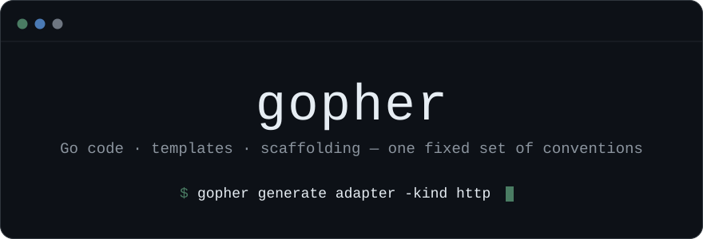

`gopher` generates Go code, templates, and project scaffolding that follow a
fixed set of conventions.

AI-generated Go drifts from personal standards — architecture, naming, error
handling, telemetry, spacing — and fixing it by hand after every generation is
slow. gopher inverts that: the style lives in versioned templates, and the model
calls a CLI to instantiate them. Claude Code runs `gopher generate`, gets
correctly-styled files, then adapts them with full project context.

The binary has **no third-party dependencies** — the standard library plus one
first-party, stdlib-only module
([pipelines](https://github.com/nxdir-s/pipelines), which fans out rendering).

## Install

```bash
go install github.com/nxdir-s/gopher/cmd/gopher@latest
```

## Usage

```bash
gopher generate <type> [flags]
gopher list [-json]              # the available types
gopher describe <type> [-json]   # the flags a type accepts
gopher templates init|list       # export and inspect the templates
```

Every `generate` command accepts:

| Flag       | Effect                                                |
| ---------- | ----------------------------------------------------- |
| `-out`     | directory the files are written to (default `.`)      |
| `-module`  | module path; defaults to the `go.mod` covering `-out` |
| `-stdout`  | print the source instead of writing it                |
| `-dry-run` | print the paths that would be written                 |
| `-force`   | overwrite existing files                              |

Existing files are never overwritten without `-force`, and every rendered Go
file is passed through `go/format` — a template that produces source which does
not parse fails the command instead of writing garbage.

### Types

| Type           | Generates                                                                                                                           |
| -------------- | ----------------------------------------------------------------------------------------------------------------------------------- |
| `setup`        | a whole hexagonal project: `cmd/`, `internal/{adapters,core,ports,config,logs}`, `go.mod`, `Makefile`, `CLAUDE.md`                  |
| `adapter`      | a secondary adapter — `kafka`, `postgres`, `http`, `aws`, `google`, `cmd`, `tmux`, `toml`, `zip`, or a `generic` skeleton           |
| ↳ `-kind http` | also emits the types it is written against: `entity.Request`, `entity.Response`, `valobj.{Method,BodyType,Header,FormField,Timing}` |
| `server`       | an http server primary adapter with graceful shutdown                                                                               |
| `entity`       | a domain object type                                                                                                                |
| `valobj`       | a value object, either a `struct` or an `enum` with `String`/`MarshalJSON`/`Parse`                                                  |
| `domain`       | an orchestrator wired to the ports it drives                                                                                        |
| `port`         | an interface appended to `internal/ports/{core,primary,secondary}.go`                                                               |
| `module`       | an internal module — `logs`, `config`, `observability`, or `generic`                                                                |
| `mocks`        | a hand-written fake with call counts, from an interface's methods                                                                   |
| `test`         | a table-driven test                                                                                                                 |
| `infra`        | an AWS CDK stack in Go, as its own module under `infra/`                                                                            |

### Examples

```bash
gopher generate setup -module github.com/you/orders -out ./orders

gopher generate adapter -kind kafka -name Events
gopher generate adapter -name Stripe                 # generic skeleton

gopher generate entity -name Order -field 'ID:int' -field 'Total:float64' -json
gopher generate valobj -name Status -kind enum -value Pending -value Delivered

gopher generate port -name OrderRepository \
  -method 'Save(ctx context.Context, order *entity.Order) error' \
  -import github.com/you/orders/internal/core/entity

gopher generate domain -name Orders -port 'repo:ports.OrderRepository'

gopher generate mocks -name OrderRepository \
  -method 'Save(ctx context.Context, order *entity.Order) error' -import context
```

The `port` generator is the only one that edits an existing file. It parses the
target, appends the interface, and unions the import blocks. Running it twice
with the same name is a no-op.

`-kind http` writes its companion types at fixed paths and never touches them
again — a second http adapter, or one generated after you have edited
`entity.Request`, reports them as `unchanged`. Pass `-force` to restore them.

## Customizing the templates

Templates resolve in this order, first match wins:

```
1. ./.gopher/templates/<name>.tmpl                 project override
2. $XDG_CONFIG_HOME/gopher/templates/<name>.tmpl   user override
3. embedded default
```

`gopher templates init` writes the embedded set into the user directory so it
can be edited; `gopher templates list` shows where each one currently resolves
from. Overrides are per file, so replacing `adapter/kafka.tmpl` leaves the rest
alone.

Every template renders against the same data, which is what makes an override
safe to write:

```go
type TemplateData struct {
    Name      valobj.Naming   // .Pascal .Camel .Snake .Kebab .Lower .Upper .Plural .Words
    Package   string
    Module    string
    Kind      string
    GoVersion string
    Fields    []valobj.Field  // from -field Name:Type[:tag]
    Ports     []valobj.Field  // from -port Field:ports.Interface
    Methods   []valobj.Method // parsed from -method
    Flags     map[string]string
    Lists     map[string][]string
    Tracer    bool
    Logger    bool
}
```

Template functions: `pascal camel snake plural lower upper contains join`.

## Configuration

`.gopher/gopher.json` in the project, `$XDG_CONFIG_HOME/gopher/config.json` for
the user. Project settings win over user settings; both lose to explicit flags.

```json
{
  "module": "github.com/you/orders",
  "out_dir": ".",
  "template_dir": "~/templates/gopher",
  "defaults": { "pkg": "adapters", "tracer": "false" }
}
```

## Development

```bash
make build test vet
make docs                              # check the docs for stale paths and links
GOPHER_UPDATE_GOLDEN=1 go test ./...   # refresh the golden files
```

gopher is itself laid out hexagonally, so its own tree is a working example of
what `gopher generate setup` produces.

Engineering docs live in [docs/](docs/):

| Doc                                            |                                                     |
| ---------------------------------------------- | --------------------------------------------------- |
| [docs/architecture.md](docs/architecture.md)   | package map, port catalog, the dependency rule      |
| [docs/pipeline.md](docs/pipeline.md)           | argv → bytes on disk, the three artifact modes      |
| [docs/templates.md](docs/templates.md)         | authoring templates: the data contract and gotchas  |
| [docs/adding-a-type.md](docs/adding-a-type.md) | worked walkthroughs plus a checklist                |
| [docs/testing.md](docs/testing.md)             | golden workflow, and what is really compile-checked |
| [docs/decisions.md](docs/decisions.md)         | why things are the way they are                     |
