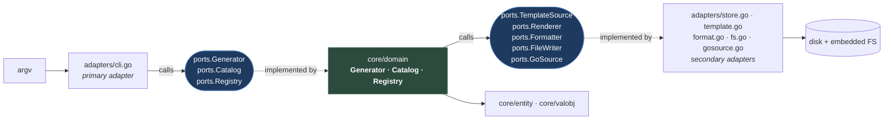

# Architecture

gopher is hexagonal: inputs and outputs sit at the edges, and the core knows
nothing about the CLI that drives it or the filesystem it writes to.

That's partly dogfooding: `gopher generate setup` emits this exact shape, so
the repo doubles as a reference for its own output. It's also practical. The
core is where the interesting logic lives (spec resolution, render ordering,
merge semantics), and it's tested against in-memory fakes with no disk access.

## Package map

```
cmd/gopher/main.go          wire dependencies, dispatch, exit code
internal/
  adapters/
    cli.go                  PRIMARY adapter: flag sets, dispatch, help, reporting
    store.go                template lookup chain: project → user → embedded
    template.go             text/template execution + the func map
    format.go               go/format; doubles as the "is this valid Go?" gate
    fs.go                   read, write, mkdir
    gosource.go             go/parser work: Declares, Merge, Methods
    fake/fake.go            in-memory Store and Writer for tests
  config/config.go          config precedence, go.mod module detection
  core/
    domain/
      generator.go          the engine: request → artifacts
      catalog.go            template listing and export
      registry.go           THE REGISTRY: one GenSpec per type
    entity/                 GenSpec, TemplateRef, Artifact, Request, TemplateData
    valobj/                 GenType, Naming, Field, Method
  logs/logger.go            slog setup; writes to stderr so it never mixes with -stdout
  ports/
    core.go                 how domains reach internal collaborators
    primary.go              how the core is driven
    secondary.go            what the core drives
templates/
  templates.go              the go:embed declaration
  files/**/*.tmpl           44 templates
```

## The shape



Solid arrows are calls, dotted arrows are "satisfies this interface". The core
points at interfaces in both directions; adapters point inward. Nothing in the
core points out.

## The port catalog

Nine interfaces across three files. The split follows the convention in
`spec.md`: `primary.go` is how the outside drives the core, `secondary.go` is
what the core drives, `core.go` is internal collaboration.

| Interface | File | Implemented by | Consumed by |
|---|---|---|---|
| `Generator` | `primary.go` | `domain.Generator` | `adapters.CliAdapter` |
| `Catalog` | `primary.go` | `domain.Catalog` | `adapters.CliAdapter` |
| `Registry` | `core.go` | `domain.Registry` | `domain.Generator`, `adapters.CliAdapter` |
| `TemplateSource` | `secondary.go` | `adapters.StoreAdapter` | `domain.Generator` |
| `TemplateCatalog` | `secondary.go` | `adapters.StoreAdapter` | `domain.Catalog` |
| `Renderer` | `secondary.go` | `adapters.TemplateAdapter` | `domain.Generator` |
| `Formatter` | `secondary.go` | `adapters.FormatAdapter` | `domain.Generator` |
| `FileWriter` | `secondary.go` | `adapters.FsAdapter`, `fake.Writer` | `domain.Generator`, `domain.Catalog` |
| `GoSource` | `secondary.go` | `adapters.GoSourceAdapter` | `domain.Generator` |

`Registry` sits in `core.go` rather than `primary.go` because the CLI reading it
for `list`/`describe` is incidental. Its real job is letting `domain.Generator`
resolve a spec without knowing where specs come from.

`TemplateCatalog` embeds `TemplateSource` and adds `List`, `Embedded`, and
`Origin`. The generator only needs `Load`, so it depends on the narrower one.

## The dependency rule

**`internal/core/**` must never import `internal/adapters/**`.**

Verify it with the import graph, not with grep:

```bash
go list -f '{{join .Imports "\n"}}' ./internal/core/domain
```

which should print exactly:

```
github.com/nxdir-s/gopher/internal/core/entity
github.com/nxdir-s/gopher/internal/core/valobj
github.com/nxdir-s/gopher/internal/ports
```

Grep gives a false positive here. `internal/core/domain/registry.go` contains
the string `internal/adapters` many times, but as *output paths* in
`TemplateRef.Out` values, not as imports:

```go
{Name: "adapter/{{.Kind}}", Out: "internal/adapters/{{.Name.Snake}}.go"},
```

Test files are the deliberate exception: `internal/core/domain/*_test.go` import
`internal/adapters` to build a generator over the real store, renderer, and
formatter. That's the point of the tests: they exercise the wiring `main.go`
does.

## Composition

Everything is assembled in one place, `run()` in `cmd/gopher/main.go`, in
dependency order: config → store → writer → registry → generator → catalog →
CLI. Adapters take functional options; the domains validate that every port they
drive was supplied and return `ErrNilDependency` if not, so a wiring mistake
fails at startup rather than at first use.

## Where the logic actually is

Most of this repo is templates and tests. The Go code that carries real
behavior is small and worth reading in full:

| File | Lines | Why it matters |
|---|---|---|
| `internal/core/domain/generator.go` | 440 | The whole engine. See [pipeline.md](pipeline.md) |
| `internal/core/domain/registry.go` | 577 | Data, not logic: 11 specs. The system's shape |
| `internal/adapters/cli.go` | 618 | Flag sets built from specs; add commands here, not types |
| `internal/adapters/gosource.go` | 380 | AST merge and signature parsing. The subtlest code here |
| `internal/config/config.go` | 265 | Precedence and module detection |
