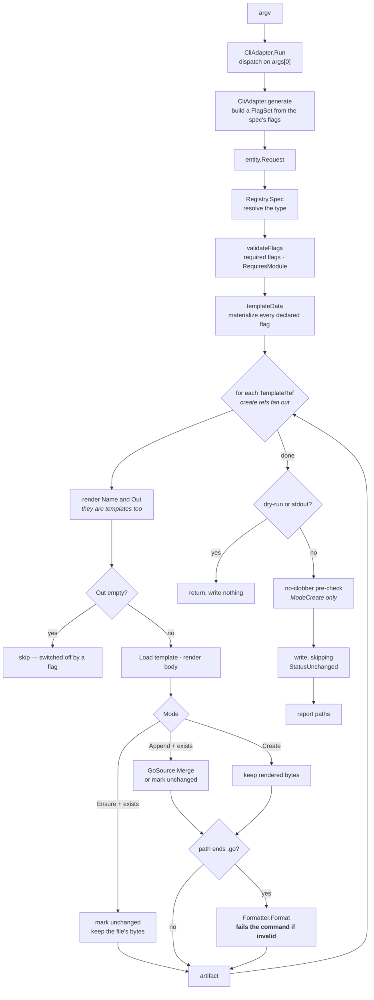

# The generation pipeline

Everything `gopher generate` does lives in `Generate`, `renderAll`, and
`render` in `internal/core/domain/generator.go`. This is that path, stage by
stage.



## The stages

**1. Resolve the spec.** `Registry.Spec(req.Type)` finds the `GenSpec`. Unknown
types never get this far — `valobj.ParseGenType` rejects them in the CLI.

**2. `validateFlags`.** Two checks: every flag with `Required: true` has a value
(list flags check `Lists`, everything else checks `Flags`), and if the spec sets
`RequiresModule`, that `req.Module` is non-empty. Only `setup` and `infra` set
`RequiresModule` — they write import paths and a `go.mod` that are meaningless
without one.

**3. `templateData`.** Builds `entity.TemplateData`. The important behavior:
**it materializes every flag the spec declares**, falling back to the flag's
default. That is why a template can write `.Flags.side` or range `.Lists.method`
without a nil check — the keys are guaranteed present for any flag on the spec.
Reaching for a key the spec does *not* declare is an error, because the renderer
sets `missingkey=error`.

It also derives `Name` from the `-name` flag, falling back to the last segment
of the module path so `gopher generate setup -module github.com/you/orders`
works without `-name`.

**4. Render `Name` and `Out`.** Both `TemplateRef` fields are themselves
templates, rendered against the same data before anything is loaded. This is
what makes `{Name: "adapter/{{.Kind}}"}` select a template by flag.

**5. Empty `Out` means skip.** If the rendered output path is blank, `render`
returns `(nil, nil)` and the ref is dropped. This is the whole conditional-file
mechanism — no extra field on `TemplateRef`, no branching in the generator:

```go
{Name: "setup/gomod", Out: `{{if eq .Flags.gomod "true"}}go.mod{{end}}`},
```

`setup` uses it for `go.mod`, `Makefile`, `.gitignore`, and `CLAUDE.md`;
`adapter` uses it to emit the http companions only when `-kind http`.

**6. Mode handling.** See the table below.

**7. Format.** `Formatter.Format` runs on outputs ending in `.go` only, so
`Makefile`, `go.mod`, `cdk.json`, and `.gitignore` pass through untouched. A
template that produces source which does not parse **fails the command** — the
error carries the template name and the offending line, and nothing is written.

**8. Write.** The no-clobber pre-check runs over all artifacts *before* any of
them is written, so a partially-written tree is not left behind. It skips
non-`ModeCreate` artifacts, which resolve existence themselves. The write loop
then skips anything marked `StatusUnchanged`.

## Concurrency

Stages 4–7 run once per ref, and for create-mode refs they share no state, so
`renderAll` fans them across `min(MaxRenderFan, GOMAXPROCS, refs)` workers
when a spec has two or more. Everything observable is unchanged: results come back tagged with
their ref index, so artifact order, report order, and the goldens match the
serial loop; the error returned is the lowest-index failure, the same one the
serial loop would have stopped at. Append and ensure refs read files on disk
and stay on the calling goroutine, and specs with fewer than two create refs
(`entity`, every `adapter` kind, `port`) never leave the serial path. The
reasoning, including why the fan cannot help a single-file `adapter` generate,
is in [decisions](decisions.md).

## Artifact modes

Set per `TemplateRef` via `Mode`. This is the piece most likely to be gotten
wrong, because two of the three modes look interchangeable and are not.

| Mode | When the file exists | Used by |
|---|---|---|
| `ModeCreate` | error, unless `-force` | everything except the two below |
| `ModeAppend` | parse it, append the new declarations, union the imports | `port` |
| `ModeEnsure` | leave it alone, report `unchanged` | `adapter -kind http` companions |

**`ModeAppend`** exists for the ports files, where many interfaces share
`internal/ports/secondary.go`. `GoSourceAdapter.Merge` re-emits the file as
package clause + unioned import block (stdlib grouped first) + existing
declarations + new ones, then it is reformatted.

Its idempotency check rides inside `Merge(existing, rendered,
data.Name.Pascal)` — one parse of the existing file both looks for a
declaration named after the **`-name` flag** and, when it is absent, feeds the
append. A declared name short-circuits to `unchanged` with the file's bytes
untouched. That makes it correct for `port`, where `-name OrderRepository`
produces `type OrderRepository interface`, and wrong for anything whose
declarations are not named after `-name`.

Both append and ensure resolve existence by reading: a missing file reports
`fs.ErrNotExist` through the `ports.FileWriter` contract and falls through to
the create path, while a file that exists but cannot be read is a hard error —
it must not be silently clobbered.

**`ModeEnsure`** exists because of exactly that limitation. The http companions
live at fixed paths (`internal/core/entity/request.go`) independent of `-name`,
so `ModeAppend` would have checked for the *adapter's* name, not found it, and
appended duplicate `Request` types on every run. `ModeEnsure` is the right
primitive for scaffolding the caller is expected to edit: write it once, then
never touch it. `-force` still regenerates.

## Statuses and output

`ArtifactStatus` drives what the CLI prints, in `report` in
`internal/adapters/cli.go`:

| Status | Normal output | With `-dry-run` |
|---|---|---|
| `StatusCreated` | `<path>` | `would write <path>` |
| `StatusAppended` | `appended <path>` | `would append to <path>` |
| `StatusUnchanged` | `unchanged <path>` | `would leave unchanged <path>` |

With `-stdout` nothing is written and the content goes to stdout. Note that an
ensure-mode artifact whose file already exists prints the *current* file, not
what would have been generated — `unchanged` means unchanged.

Logging goes to stderr (`internal/logs/logger.go`), so `-stdout` output stays
pipeable. Set `GOPHER_DEBUG` for per-artifact debug lines.

## Exit codes

Defined in `internal/adapters/cli.go`:

| Code | Constant | Meaning |
|---|---|---|
| 0 | `ExitOk` | success |
| 1 | `ExitError` | the operation failed — file exists, bad template, missing flag value |
| 2 | `ExitUsage` | the invocation was wrong — unknown command, unknown type, bad flag |

## Errors

Every error is a custom struct type with an `Error() string` method; there is no
`fmt.Errorf` in the codebase. The ones worth knowing:

| Error | Package | Raised when |
|---|---|---|
| `ErrFileExists` | `domain` | `ModeCreate` target exists and `-force` was not passed |
| `ErrMissingFlag` | `domain` | a `Required` flag got no value |
| `ErrMissingModule` | `domain` | `RequiresModule` spec with no module resolved |
| `ErrRenderTemplate` | `domain` | wraps a format failure with the template name |
| `ErrMergeArtifact` | `domain` | append-mode merge failed |
| `ErrNilDependency` | `domain` | a port was not supplied at construction |
| `ErrInvalidSource` | `adapters` | `go/format` rejected the output; annotates the offending line |
| `ErrTemplateNotFound` | `adapters` | no template by that name in any tier |
| `ErrPackageMismatch` | `adapters` | append-mode merge across different packages |

Those that wrap a cause implement `Unwrap`, so `errors.As` reaches through —
which is how the tests assert on them.

## Config and module resolution

`config.Load(cwd)` merges, in increasing precedence:

1. `$XDG_CONFIG_HOME/gopher/config.json` (or `~/.config/gopher/config.json`)
2. `<project root>/.gopher/gopher.json`, found by walking up for `.gopher/` or `go.mod`
3. explicit flags

`Defaults` in the config file supply per-flag defaults, applied only to flags the
user did not pass — the CLI distinguishes the two with `FlagSet.Visit`.

Module resolution has one non-obvious rule, in `CliAdapter.generate`: **an
explicit `-out` re-resolves the module from the output tree**, via
`config.FindModule`. Without it, generating into a directory outside the current
project would stamp the *current* project's module path into the imports of the
generated code. If `-out` is not given, the module comes from the `go.mod`
covering the working directory.
